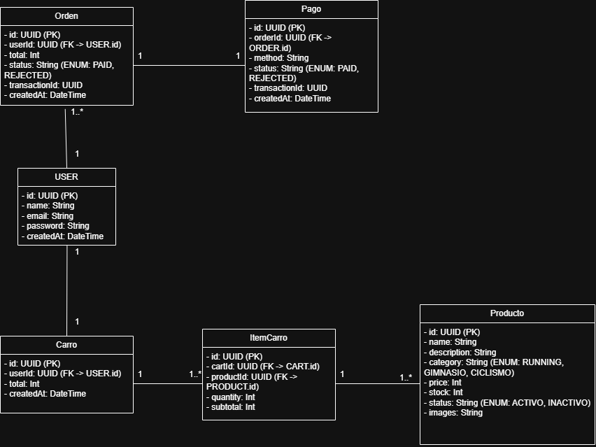

# ECI-SportLife

# funcionalidades

1. primer punto

**FUNCIONALES**

1) registrarse
2) autenticarse/login
3)
4) consultar listado productos disponibles
4) filtar por categoria o nombre
5) consultar informacion de producto especifico
6) agregar productos a carrito
7) pagos

**NO FUNCIONALES**

1) mostrar resumen de productos seleccionados

| ID    | funcionalidade                | prioritarias | bloquean a otras           | depende de          |
|-------|-------------------------------|--------------|----------------------------|---------------------|
| RF-01 | Registrarse                   | ALTA         | RF-02- RF-07 - RF-06       | NA                  |
| RF-02 | Autenticarse                  | ALTA         | RF-07 - RF-06              | RF-01               |
| RF-03 | Consultar listado productos   | MEDIA        | RF-04, RF-05, RF-06, RF-07 | RF-02               |
| RF-04 | Filtrar por categoría/nombre  | MEDIA        | RF-06                      | RF-02, RF-03        |
| RF-05 | Consultar producto específico | MEDIA        | RF-06                      | RF-02, RF-03        |
| RF-06 | CRUD producto al carrito      | ALTA         | RF-07 - RF-08              | RF-02, RF-03        |
| RF-07 | Procesar pago                 | ALTA         | NA                         | RF-02, RF-06, RF-08 |
| RF-08 | Ver resumen del carrito       | MEDIA        | RF-07                      | RF-06               |

2. Para cada una de las funcionalidades previamente identificadas mencione:

| ID    | VERBO                 | funcionalidad idempotente | razon                                                          | datos entrada                      | datos salida                                                   | ejemplo                                                                     | validaciones de entrada input                                                                                            | happy path                       | flujo error      |
|-------|-----------------------|---------------------------|----------------------------------------------------------------|------------------------------------|----------------------------------------------------------------|-----------------------------------------------------------------------------|--------------------------------------------------------------------------------------------------------------------------|----------------------------------|------------------| 
| RF-01 | POST                  | NO                        | ya que mantiene el mismo formato pero altera el sistema        | NOMBRE-CORREO-CONTRASENA           | ID CON UUID Y LOS DATOS DE ENTRADA                             | { "name": "Juan", "email": "juan@mail.com", "password": "Pass123!" }        | Email formato válido, password mínimo 8 caracteres, email no duplicado en BD                                             | 201 CONFIRMACION Y OBJETO CREADO | 400  Y 500       | 
| RF-02 | POST                  | NO                        | cada llamada genera un nuevo token JWT distinto                | CORREO-CONTRASENA                  | TOKEN, ID                                                      | { "email": "juan@mail.com", "password": "Pass123!" }                        | Email con formato válido, password no vacío, credenciales correctas en BD                                                | 200 CONFIRMACION                 | 400-401-500      |
| RF-03 | GET                   | SI                        | las consultas no alteran el sistema y que solo obtenemos datos | NA, SOLO ES UN GET/ PRODUCTOS      | id, name, category, price, stock, status, imagen               | GET /products?page=1&limit=10                                               | Solo productos con status: activo, page y limit deben ser enteros positivos                                              | 200 CONFIRMACION                 | 400-401-500      |
| RF-04 | GET                   | SI                        | aunque se filtre, mantiene el mismo estado del sistema         | CATEGORIA O NOMBRE (STRING)        | id, name, category, price, stock, status, imagen               | GET /products?category=running o GET /products?name=camiseta                | Al menos un filtro presente, category debe ser un valor válido del catálogo, name mínimo 2 caracteres                    | 200 CONFIRMACION                 | 400-401-500      |
| RF-05 | GET                   | SI                        | las consultas no alteran el sistema y que solo obtenemos datos | ID DEL PRODUCTO                    | id, name, description, category, price, stock, images , status | GET /products/uuid-123                                                      | UUID con formato válido, producto debe existir, producto debe estar activo                                               | 200 CONFIRMACION                 | 400-401-500      |
| RF-06 | POST - DELETE - PUT   | SI                        | este hace cambios en el sistema ya que se agrega los productos | ID DEL CARRITO - CANTIDAD (ENTERO) | id del carrito, lista de productos, total de procutos          | POST /cart → { "productId": "uuid-123", "quantity": 2 }                     | Producto debe existir y estar activo, quantity mayor a 0, stock disponible >= quantity solicitada, usuario autenticado   | 200 CONFIRMACION                 | 400-401-500-409  |
| RF-07 | POST                  | NO                        | los pagos no generan cambios en el sistema                     | ID DEL CARRITO - METODO DE PAGO    | id de la orden, id de la transaccion, estado, total            | POST /orders/pay → { "cartId": "cart-456", "paymentMethod": "credit_card" } | Carrito no vacío, carrito pertenece al usuario autenticado, stock disponible al momento del pago, método de pago válido  | 200 CONFIRMACION                 | 400-401-500-409  |
| RF-08 | GET                   | SI                        | mantiene el  mismo formato y no altera el sistema              | ID DEL CARRITO                     | id del carrito, lista de productos, cantidad por item, total   | GET /cart/cart-456                                                          | CartId válido, carrito pertenece al usuario autenticado, carrito debe existir                                            | 200 CONFIRMACION                 | 400-401-500-409  | 

3. Genere el diagrama de componentes general del sistema SportLife
   

4. Genere el diagrama de componentes específicos del sistema SportLife
   

5. Genere el diagrama de clases de los modelos - Implemente patrones de
   software en su solución y establezca porque cada patrón es necesario.
   

**PATRONES**

Singleton

La conexión a la base de datos debe ser una sola instancia en toda la aplicación. Si cada servicio creara su propia conexión, se agotarían los recursos del servidor.

---

Factory

Cuando el pago se procesa, el sistema necesita crear una Order con estado PAID o REJECTED según el resultado. La OrderFactory centraliza esa lógica de creación y evita tener condicionales regados por todo el código.

6) Genere el diagrama de Base de Datos:

a. Un modelo Relacional

b. Un modelo No relacional

7) ¿Que tipo de seguridad se debería implementar en la aplicación de SportLife y que ventajas a nivel de seguridad le ofrece?
1. la parte de JWT para proteguer los endpoints
2. tambien lo de HTTPS para el cifrado de contrasenas
3. la parte de validacion para garantizar que los datos no sea erroneos o incorrectos

8) ¿Cuáles Roles identifica en el caso de estudio, y en qué funcionalidades
   debería tener permisos?

**GUEST**: Usuario no registrado
**CUSTOMER**: Usuario registrado y autenticado
**ADMIN**: Administrador del sistema

| Funcionalidad              | GUEST | CUSTOMER | ADMIN |
|----------------------------|-------|----------|-------|
| Registrarse                | SI    | NO       | NO    |
| Autenticarse               | SI    | SI       | SI    |
| Ver listado de productos   | SI    | SI       | SI    |
| Filtrar productos          | SI    | SI       | SI    |
| Ver producto específico    | SI    | SI       | SI    |
| Agregar al carrito         | NO    | SI       | NO    |
| Ver resumen carrito        | NO    | SI       | NO    |
| Procesar pago              | NO    | SI       | NO    |
| Gestionar productos (CRUD) | NO    | NO       | SI    |
| Ver todas las órdenes      | NO    | NO       | SI    |
| Activar/inactivar productos| NO    | NO       | SI    |

9) ¿Cómo se implementa TLS/SSL en una API Rest y qué ventajas ofrece
   para la aplicación?

TLL nos ayuda a cifrar la informacion entre el cliente y el servidor. el SSL es la version que se manejaba antes.

la forma en la que se implementa es primero se obtiene un certificado digital y luego se configura el servidor para que finalmente en la pagina se vea  la peticcion HTTPS

las ventajas que tiene esto es que nos ayuda a un mejor control de seguridad para la parte del token, tambien que los datos no se pueden modificar en el transito y que se
garantiza la seguridad como lo vemos en las paginas web con el candado

10) ¿Por qué es importante usar CORS en una API Rest?

controla qué dominios externos pueden hacer peticiones a tu API. Por defecto el navegador bloquea cualquier petición que venga de un dominio diferente al del servidor.

